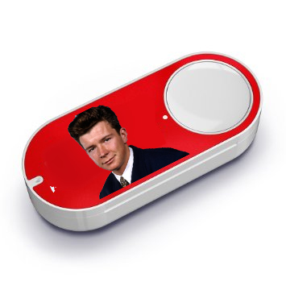

# Amazon Dash Rickroll
This is a node.js application to Rickroll somebody who presses your Amazon Dash button.

I was inspired by some cool Dash hack like this [Baby hack] (https://medium.com/@edwardbenson/how-i-hacked-amazon-s-5-wifi-button-to-track-baby-data-794214b0bdd8) by Edward Bensen, and [Pizza Dash](https://github.com/bhberson/pizzadash) by Brody Berson, and this project is made possible by [node-dash-button](https://github.com/hortinstein/node-dash-button#find-a-dash) by Alex Hortin.

Thank you for these guys, I was able to hack my dash button in such a short amount of time! Yay!!!


## Demo

See it in action in 6 sec on [Vine](https://vine.co/v/e2m3emJZVqB)!




## Running the App on your Local Machine

### Requirement

Make sure you have node.js running on your machine.

### Hardware Setup

For the first time setting up Dash, use the Amazon Shopping app and connect to yur WiFi by following the instructions. However, do *not* select any product for purchase, just quit the app.

### Software Setup

Fork this code, then install the dependency, `node-dash-button`:

```bash
$ npm install
```

Before running this app, you need to obtain your dash's MAC address. 

```bash
$ cd node_modules/node-dash-button
$ node bin/findbutton
```

See this [instruction](https://github.com/hortinstein/node-dash-button#find-a-dash) for more details.

Then create a `config.js file` and define your Dash's MAC address.

```javascript
module.exports = {
  dash: {
    MAC_address: '2c:f0:xx:xx:fc:xx'
  }
};
``` 

Run

```bash
$ sudo node index.js
```

Now press your Dash and see what happens.
